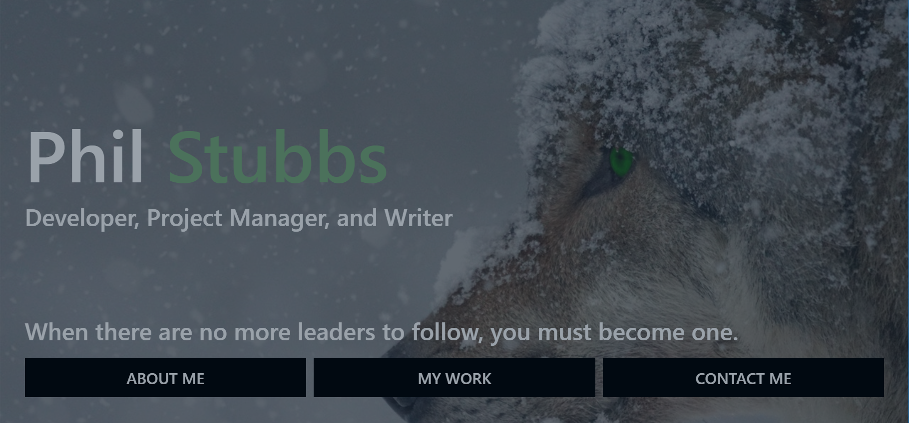
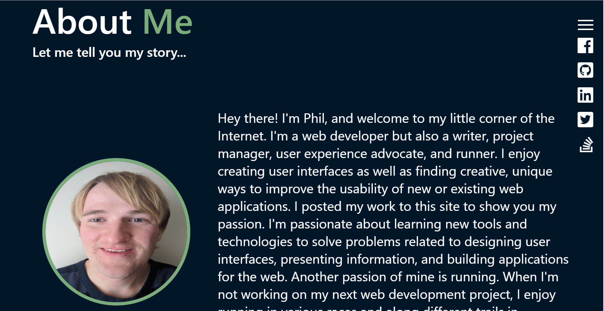
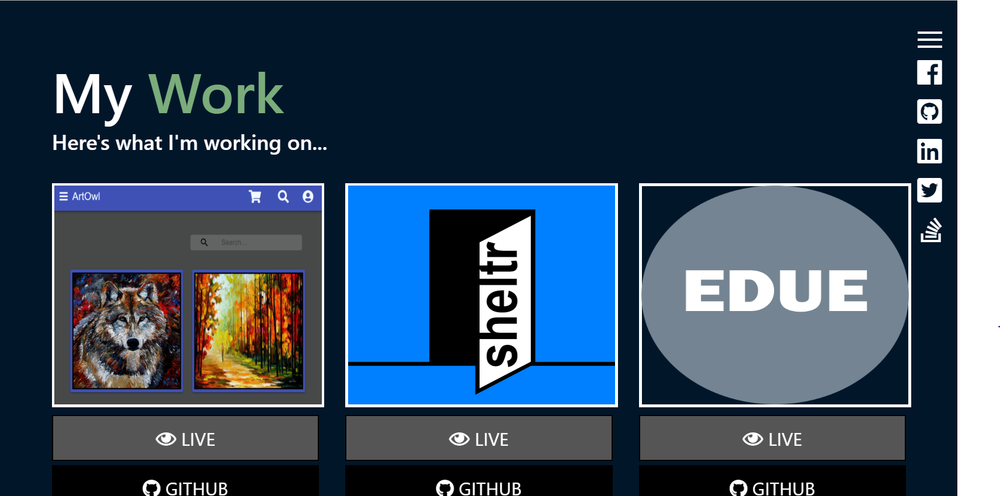
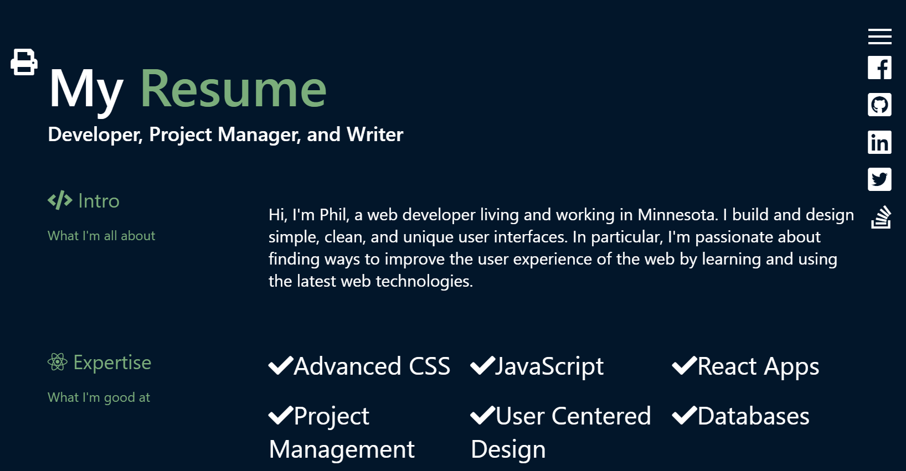
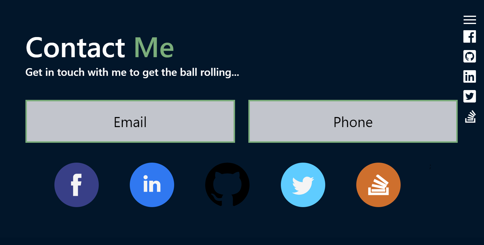

# Alpha

"When there are no more leaders to follow, you must become one." This quote is from the movie Alpha. The movie is about a boy named Keda who goes on his first hunt with his tribe but gets separated after coming face to face with a buffalo. To find his way back home, he forms a close friendship with a lone wolf that also got separated from her pack. To overcome the odds of making it back home and surviving before the harsh, cold winter, Keda must take charge and be strong to not only save his life but also save the life of his new friend. 

This movie and quote really define what I haved faced and battled to get to this point in my life so far. My life has been nothing but easy. I have had to stand up for myself when others around me haven't, be bold when making the right choices, and have courage to continue to move on despite the constant obstacles and challenges in my way. As a result, I created this website so that you can see what I have been through, what I face now, and what I want to pursue next.

For more information about the movie, you can watch the trailer here: <https://www.youtube.com/watch?v=uNFufvM7qNU>.

## Table of contents

* [Live](#live)
* [Screenshots](#screenshots)
* [About this project](#about-this-project)
  * [How the app is built](#how-the-app-is-built)
  * [App workflow](#workflow)
  * [Structure of the project](#project-structure)
* [Getting started](#getting-started)
* [Deploying the app](#deployment)
* [Technologies used to create app](#technologies-used)
  * [Back end technologies](#Backend)
  * [Front end technologies](#Frontend)
  * [Other technologies](#Other)
* [Direction for future development](#future)
* [Issues](#Issues)

## Live

The website is current live at the following URL:
<http://www.philjstubbs.com>

##  Screenshots

### Landing/Home Page

### About me page

### My work page

### Resume page

### Contact me page

##  About this project

This is my portfolio website built using React. It includes information about me, my resume, projects I have worked on, and information on how to get in touch with me.

My original portfolio website was built using vanilla JavaScript and Handlebars. You can find the source code for that site available here: <https://github.com/philipstubbs13/coding-portfolio>. The more I developed that site, the more I became less and less satisfied with it. Over time, it became more and more difficult to maintain. So, that's why I created a new portfolio site with React so that I can update and maintain it quickly as I spin up new projects.

Just a little bit about me... I graduated from the University of Minnesota Full Stack Web Development program in May 2018. This site not only showcases the projects I completed during that program but also projects I am currently working on so that you can get to know a little bit more about me and my life as a web developer. As I continue my web development journey, I will continue to add new projects to this site that you can explore and learn more about.

If you have any questions, comments, or find any issues with the site or one of the projects showcased on this site, feel free to email me at philipstubbs13@gmail.com.

###  How the app is built

On the front end side, this project is built using React, which is an open-source Javascript library developed at Facebook specifically for the task of developing user interfaces. React relies on a component-based architecture where elements of the user interface are broken into small chunks of code called components. To design and build the user interface, I used css grid to align, justify, and place components on the page.

This project is currently a client-side application. In the future, I plan to add a backend database where I can store and retrieve blog posts, user comments, projects I have worked on, as well as my resume. Finally, Firebase Hosting is used to deploy and host the site.

###  App workflow

#### Landing/Home page

When you first visit the website, you will see the Landing/Home page. From this page, you can navigate to the rest of the website by clicking <b>ABOUT ME</b>, <b>MY WORK</b>, or <b>CONTACT ME</b> across the bottom of this page. 

#### About me page

The about me page includes a little intro to who I am, including a photo of me and a short biography.

### My work page

The my work page includes all of the projects I have worked on and contributed to as well as the projects I am currently building. Each project includes a link to the source code on GitHub, and if there's a user interface for a project, there will also be a link that will take you to the applicable website. Also, when you hover over a project, the project name will appear.

### My resume page

The my resume displays the HTML version of my resume. If you want to print the resume, you can simply click the printer icon in the top left corner of the page to get a PDF version for printing.

### Contact me page

The Contact me page is probably the simplest page of the website but probably the most important when you visit this site (which is why I kept the design of this page short, simple, and easy to navigate). If you hover over the <b>Email</b> or <b>Phone</b> buttons, my email or phone number (respectively) will be displayed. This page also contains links to my LinkedIn, Twitter, Facebook, Stackoverflow, and GitHub accounts

###  Structure of the project

After you clone the repository, you can navigate to the project root directory (alpha). The project directory structure will be set up as follows:

* <b>public</b>: The public folder contains the index.html file. This HTML file is a template. The file is empty. So, if you open it directly in a browser, you will get an empty page. Rather than placing the HTML code directly in index.html, this app uses a React component-based architecture to create, build, and render UI components to the page.
* <b>src</b>: The src folder is where the React app components reside.
  * <b>images</b>: Contains the images used in the app.
  * <b>App.js</b>: The App.js file is where the app components are imported and rendered, such as the header, footer, and various pages.
  * <b>index.js</b>: The index.js file is the top level file of the React app. In index.js, the App.js file is imported, and the ReactDOM.render method is used to render App.js to the page.
  * <b>components</b>: The Components folder is where the app components that are reused across the app are located. Each file represents a separate component. For example, Footer.js is the footer component.
  * <b>components/layout</b>: Holds all the pages of the app and the child components within those pages. For example, inside of the layout folder, there is a Resume folder. The Resume folder contains a top-level parent container/page called Resume.js.
  * <b>App.css</b> and <b>index.css</b>: The external css stylesheets for the app.
* <b>firebase-config.js</b>: contains the Firebase initialization code to connect the app to Firebase.
* <b>.eslintrc.json</b>: List of rules and their definitions for ESLint.
* <b>.gitignore</b>: Anything listed inside this file (for example, node_modules) will not be tracked by GitHub when code is committed.
* <b>package.json</b>: Lists the project dependencies and their version numbers.
* <b>README.md</b>: The README file that contains important information about this project.
* <b>yarn.lock</b>: Dependency tree for the project. Lists all the client dependencies and their versions.
* <b>readme_images</b>: Images used in the project README file.
* <b>.firebaserc</b>: Hidden file that allows you to quickly switch between projects with 'firebase use'.
* <b>.gitignore</b>: Anything listed inside this file (for example, node_modules) will not be tracked by GitHub when code is committed.
* <b>database.rules.json</b>: Contains read/write rules for reading and writing data to the Firebase database.
* <b>firebase.json</b>: Firebase configuration file required to deploy the site to Firebase.
* <b>package.json</b>: Lists the project dependencies and their version numbers. It also contains various scripts to start the server, create a production build, etc.
* <b>yarn.lock</b>: Dependency tree for the project. Lists the project dependencies and their versions.